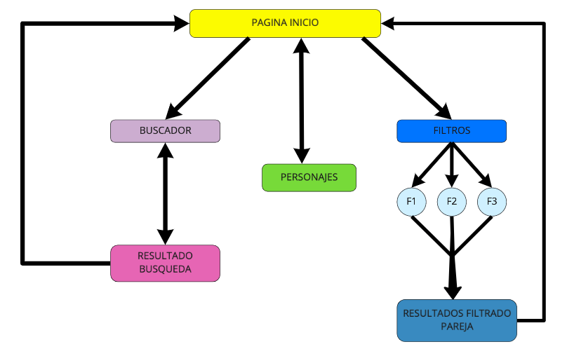
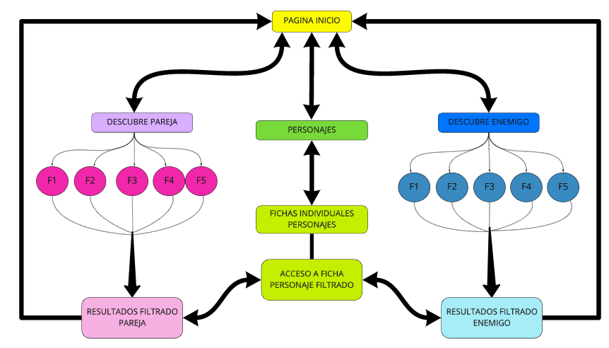
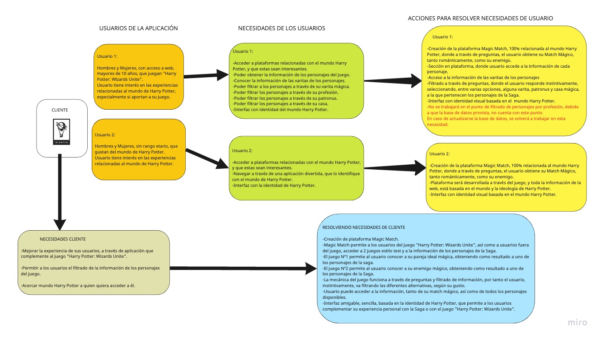
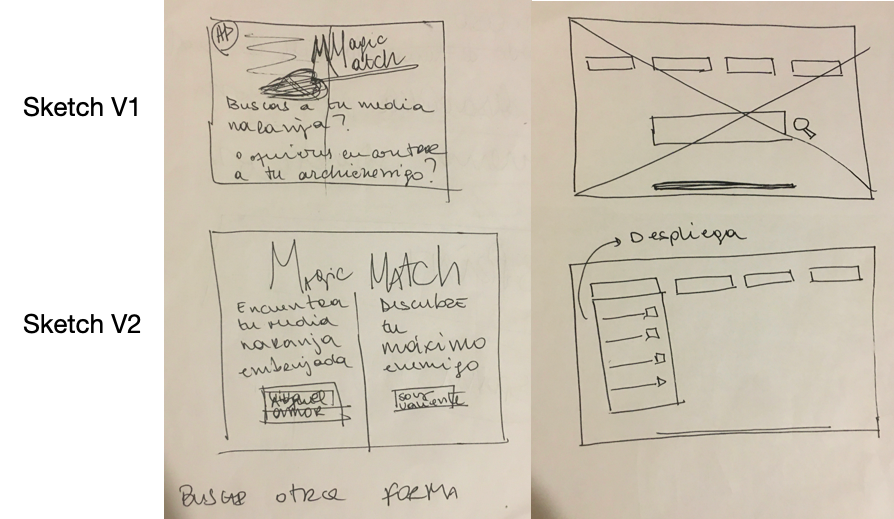
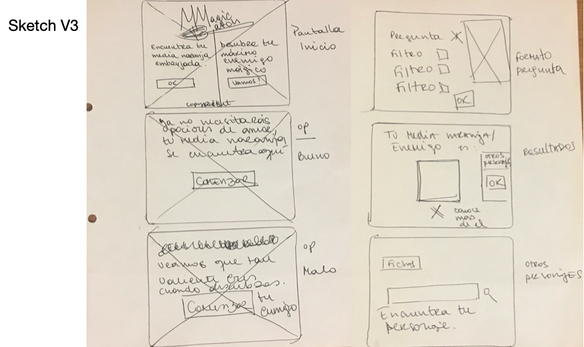
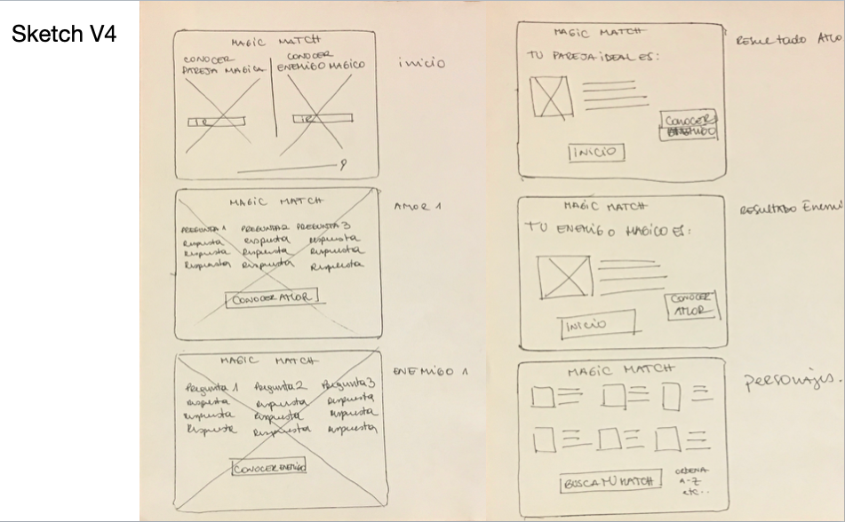
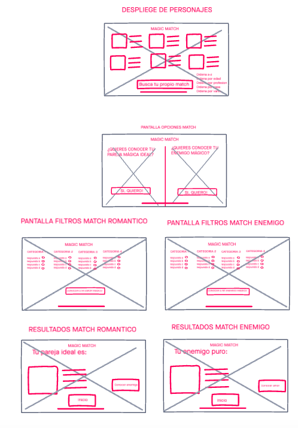
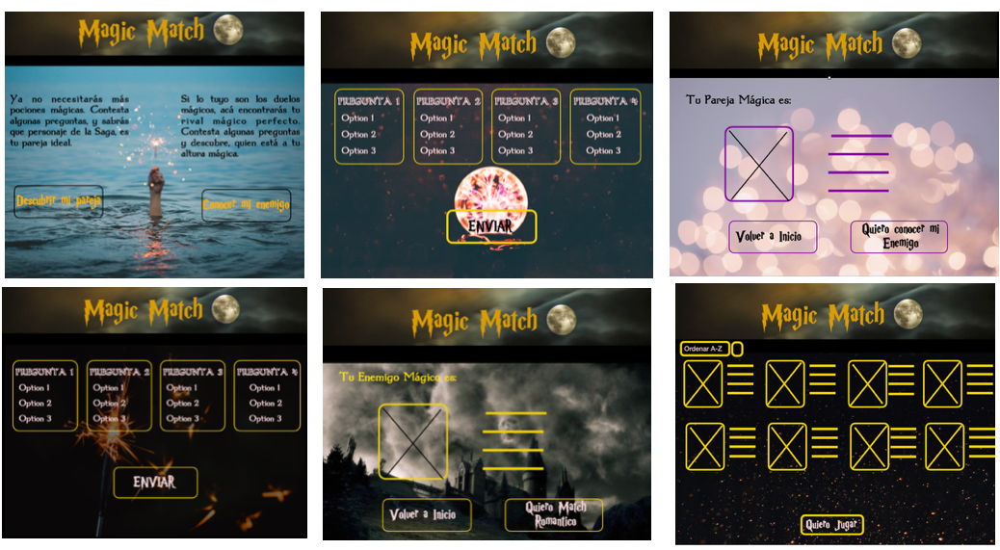

:zap: MAGIC MATCH :zap:

### INDICE

* [1. INTRODUCCIÓN A MAGIC MATCH](#introduccion)
* [2. MAGIC MATCH: TODO LO QUE NECESITAS SABER](#informacion)	
* [3. PLANIFICACIÓN](#construccion)	
* [4. DISEÑO UX](#diseno)	
* [5. CONCLUSIONES Y REFLEXIONES](#conclusiones)	
* [6. AGRADECIMIENTOS](#agradecimientos)	


<a id="introduccion"> :sparkles: 1. INTRODUCCIÓN A MAGIC MATCH :sparkles: </a>

Magic Match es una plataforma web basada en el imaginario de Harry Potter, que ofrece a sus usuarios la oportunidad de jugar dos tests, donde podrán encontrar su alma gemela mágica y su enemigo mágico, dentro de los personajes de la Saga.

Adicionalmente, el usuario tiene acceso a la información técnica de cada uno de los personajes disponibles. 

***

<a id="informacion">  :boom: 2. Magic Match: Todo lo que necesitas saber	:boom: </a>

***Magic Match*** nace como respuesta ante la necesidad de nuestro cliente, por mejorar la experiencia de usuario de los jugadores de la plataforma: "Harry Potter: Wizards Unite". 

Luego de sus propios estudios en usuarios, se dieron cuenta que había ciertos elementos que podrían ser útiles de implementar, ya que aportarían a mejorar la experiencia  de aquellos usuarios. 

Estos elementos son:

-Poder filtrar personajes por sus características, particularmente: 

*Patronus 
*Varita Mágica 
*Casa Mágica
*Profesión

-Poder acceder a la información de los personajes disponibles en la base de datos. 

Bajo este concepto se concibe ***Magic Match***, cuyo objetivo principal es complementar la experiencia de usuario de los jugadores de "Harry Potter: Wizards Unite", a través de una plataforma web, que les permita participar de dos experiencias de estilo test. Como recompensa obtendrán sus Match Mágicos dentro de la gama de personajes disponibles, tanto en categoría Pareja,como Enemigo. 

El usuario además puede acceder a una sección de Personajes, donde encontrará las fichas técnicas de cada uno de los personajes que forman parte de la base de datos dispuesta por nuestro cliente. 

La plataforma ***Magic Match*** también permite el acceso a usuarios que no son participantes de "Harry Potter: Wizards Unite", pero que si se sienten atraídos por las experiencias relacionadas al mundo de Harry Potter. 

**¿Cómo funciona?**

El usuario entra a la Plataforma de ***Magic Match***, escoge entre Descubrir su Pareja Mágica, su Enemigo Mágico o Conocer más sobre los personajes disponibles. 
No es necesario registrarse, ni estar vinculado a ninguna otra plataforma para acceder. 

Una vez que accede a cualquiera de los dos juegos disponibles, se le presenta un set de 5 preguntas, donde el usuario debe escoger su respuesta. 
Este set de preguntas está creado a partir de los elementos que desea implementar nuestro cliente, por tanto hay preguntas relacionadas con las varitas, los Patronus y las casas mágicas de los personajes. 

El mecanismo por el cuál se obtiene el match mágico del usuario es a través del filtrado, por tanto, el usuario efectivamente cumple con el objetivo técnico de filtrar, y lo hace a través de las respuestas que va entregando en cada pregunta, pero este es un filtrado intuitivo que entrega un resultado en función del instinto del usuario, y no un filtrado racional que solo arroja un orden predeterminado. 

Por otra parte, cuando el usuario ingresa a la categoría para conocer más sobre los personajes, puede ver las fotos de cada uno de ellos en la pagina web, las cuales puede ordenar bajo distintos criterios, como alfabéticamente y por relevancia. 
Al hacer click en cualquiera de las fotos disponibles, el usuario accede a una ficha técnica con información del personaje seleccionado. 


***	


<a id="construccion"> :dizzy: 3. CONSTRUCCIÓN DEL PROYECTO :dizzy: </a>

Te invitamos a acceder nuestra plataforma de trabajo, donde podrás ver gráficamente todo el proceso de este Proyecto. 

[Ingresa aquí a nuestro Board en Miro](https://miro.com/welcomeonboard/5Yy90mCtve1ddMJERFMiUXw5wQrPaYKfvtROmuIpzWqNOF85IgoVaKUB2NicW6vB)


### El comienzo 


Todo empieza cuando nuestro cliente plantea la necesidad de crear una plataforma que potenciara la experiencia de los usuarios de "Harry Potter: Wizards Unite", implementando soluciones a las necesidades descubiertas luego de investigaciones UX. 

Si bien lo esencial era implementar el mecanismo de filtrado, y desplegar las fichas de los diferentes personajes, no queríamos simplemente ser un apéndice enciclopédico para el juego, sino estimular al usuario a partir de una experiencia interactiva, intiutiva y con recompensas.

Ideamos un primer Diagrama de Flujo de la aplicación, donde se refleja la primera aproximación a nuestra propuesta.



Con este primer paso teníamos un punto de partida, pero luego de ir trabajando en nuestra propuesta y recibiendo feedback, se concibió la idea de lo que hoy es ***Magic Match***: Una aplicación que no solo muestra al usuario su afín de pareja en el mundo de Harry Potter, sino también su enemigo. 
Con esto, ***Magic Match*** se convirtió en una idea ganadora para nuestro equipo. 

Luego de tener claro hacia donde nos dirigíamos, comenzamos nuestra planificación, para llevar a cabo el proyecto. 


### Organización del Proyecto

Nuestra forma de trabajo se basa en la metodología SCRUM de Metodologías Ágiles. 

Comenzamos nuestro proceso de planificación desglosando cada diferente tarea y objetivo en un tablero de trabajo. 

[Visita acá nuestro Desglose del Proyecto](https://trello.com/b/uGPxOAaF/harry-potter)

Con una aproximación más clara de nuestras misiones y objetivos, creamos una calendarización de nuestro proyecto, en la misma plataforma.

[Visita acá nuestro Calendario](https://trello.com/b/x3gtxXLE/calendario-planificaci%C3%B3n-data-lovers)


El proceso de planificación se dividió en 4 Sprint: 

-Planificación e Investigación
-Desarrollo
-Codeo
-Testeo y Afinamiento. 

La idea general de nuestra planificación fue setear tareas diarias, para ir resolviendo en equipo.

Cada día realizamos un Daily Meeting, que nos sirvió para ir poniéndonos al tanto como equipo, e ir avanzando en conjunto hacia los objetivos diarios. 

Al final de cada Sprint tuvimos una Retrospectiva de la semana, donde preparamos el tablero de Actividades para el siguiente Sprint. 

Con la planificación clara, procedimos a trabajar en nuestro proyecto. 


### Desarrollo

SPRINT :one:

Comenzamos el Sprint tomando dos lineas principales de trabajo. La primera fue Investigación, donde se estudió constantemente las distintas temáticas a aplicarse en nuestro proyecto, desde las diferentes perspectivas desde donde debe ser construido. 

En paralelo, tuvimos el proceso de búsqueda para definir y redefinir la aplicación, y setearla como lo que actualmente proponemos como Magic Match. 

Creamos un nuevo diagrama de flujo, el cuál marca el flujo real con que se desarrolla la aplicación actualmente. 



Tambien definimos a nuestros Usuarios y sus necesidades. 

Hicimos Sketchs del proyecto y creamos protitpos de baja, los cuales fueron probados e hicimos iteraciones, según el feedback obtenido. 

Se creó un prototipo de Alta en Figma.

Se escribieron Pruebas de usuario y Criterios de Aceptación. 

Se hicieron pruebas de usuario con el protipo en Alta. 

En paralelo, estuvimos investigando y practicando Java Script para aplicar en la plataforma. 

Finalmente, integramos en la plataforma Miro, todos los documentos de nuestro proyecto, que es el link presentado el inicio de esta Categoría. 

Terminamos la semana con una retrospectiva, y reformulamos el Tablero de Actividades del Sprint 2, incluyendo las historias de Usuarios. 

Sprint 2. 


Sprint 3. 


ACA TENEMOS QUE DESCRIBIR BIEN. DE MANERA CLARA Y SIN ALARGARSE TANTO, TOMANDO EN CUENTA QUE TENEMOS QUE DESCRIBIR BIEN EL PROCESO UX. 


***
 
<a id="diseno">  first_quarter_moon: 4. DISEÑO UX first_quarter_moon: </a>


El eje central de nuestro trabajo fue el diseño UX. 

Nuestro proceso de construcción del proyecto tiene como objetivo principal exponenciar la experiencia de los usuarios de "Harry Potter: Wizards Unite", bajo la implementación de mecanismos solicitados como requisito técnico fundamental. 

A continuación detallamos paso a paso, toda la construcción del diseño UX de la plataforma Magic Match. 

### Usuarios Plataforma 


Podemos identificar 2 perfiles de usuario predominantes en nuestra aplicación.


:black_medium_small_square:	Usuario que juega "Harry Potter: Wizards Unite". 

:black_medium_small_square:	Usuario que no juega "Harry Potter: Wizards Unite", pero que gusta de involucrarse con el mundo de Harry Potter. 


**Perfil Usuario A:** 

Hombres y mujeres. 
Mayores de 10 años.
Usuarios de "Harry Potter: Wizards Unite".
Con acceso a plataforma web. 


Usuario A, es un hombre o mujer, mayor de 10 años, con acceso a plataforma web. 
Este usuario juega activamente el juego "Harry Potter: Wizards Unite". 
Este usuario disfruta de utilizar plataformas que lo involucren en el mundo de Harry Potter, especialmente si esa experiencia va a ser un aporte para su experiencia en otras instancias, por ejemplo, al momento de elegir algunas características de su perfil en la plataforma donde juega. 

Necesidades Usuario A:

* Acceso a plataforma relacionada con el mundo Harry Potter
* Plataforma que potencie su experiencia en relación a "Harry Potter: Wizards Unite". 
* Poder obtener información sobre los personajes del juego 
* Conocer información sobre las varitas de los personajes 
* Poder hacer filtrado de los personajes con distintas categorías, entre ellas: Varita Mágica,    Patronus y Casa Mágica. 
* Acceder a una interfaz amigable que se representa la identidad visual de Harry Potter. 


***Perfil Usuario B***

Hombres y mujeres. 
Sin rango etario
Gustan del mundo Harry Potter. 
Con acceso a una plataforma web


Usuario B, es un hombre o mujer, sin rango etario, con acceso a plataforma web. 
Este usuario gusta del mundo Harry Potter, por tanto disfruta y tiene interés en las instancias que lo relacionen a este. 

Necesidades Usuario B:

* Acceso a plataforma relacionada con el mundo Harry Potter y que esta sea interesante. 
* Navegar en una aplicación divertida, que lo identifique con el mundo de Harry Potter. 
* Acceder a una interfaz amigable que se represente la identidad visual de Harry Potter. 





### Interfaz y Prototipado :memo: :computer:

Para la construcción de la interfaz de la aplicación, trabajamos en continuas iteraciones de prototipos en baja y alta, con el fin de tener un feedback nutrido gracias a las pruebas de usarios. 

Comenzamos realizando sketchs en lápiz y papel, para luego digitalizarlos y construir un primer prototipo en baja. 

La idea era testear si el concepto de nuestra aplicación era bien acogido, y si funcionaba el flujo de la aplicación. 







Luego de estos primeros testeos, pudimos validar que nuestra aplicación tenía buena acogida, pero que era fundamental darle la visualidad de la aplicación. 

Realizamos una iteración en baja, con un primer acercamiento visual. El objetivo era obtener feedback sobre la estética de la aplicación, y revalidar el concepto de esta misma. 
Gracias al feedback recibido, decidimos trasladar el proceso a Figma, para realizar nuestro primer Prototipo en Alta. 



Con este prototipo en Alta listo, hicimos una ronda de feedback, donde aplicamos algunos cambios menores y comenzamos a probar nuestra prueba a mayor escala, a través de entrevistas grabadas y pautadas con guión. 


[Entrevista 1](https://trello.com/b/x3gtxXLE/calendario-planificaci%C3%B3n-data-lovers)
[Entrevista 2](https://trello.com/b/x3gtxXLE/calendario-planificaci%C3%B3n-data-lovers)
[Entrevista 3](https://trello.com/b/x3gtxXLE/calendario-planificaci%C3%B3n-data-lovers)
[Entrevista 4](https://trello.com/b/x3gtxXLE/calendario-planificaci%C3%B3n-data-lovers)
[Entrevista 5](https://trello.com/b/x3gtxXLE/calendario-planificaci%C3%B3n-data-lovers)


Como resultado final 
PRUEBAS DE USUARIO

PROTOTIPO ALTA

GUION PARA PROTOTIPO
PRUEBAS DE USUARIO - DESCRIPCION. VIDEOS . TRANSCRIPCIONES 


CONCLUSIONES 

COMO DEFINIMOS INTERFAZ USUSARIO 

:o: Existen los usuarios perfilados. 

:o: El usuario siempre está en búsqueda de una mejor experiencia de usuario. 

:o: El usuario disfruta la plataforma. 

:o: etc

:o: resolvemos necesidades de Cliente? 

:o: resolvemos necesidades de ususario? 

:o: 
¡
NUEVO PROTOTIPO EN ALTA IMPLEMENTADO EN MAZE 


!
ANALISIS Y RESULTADO 


PRODUCTO FINAL  + LINK EN GIT HUB PAGES 


***	

<a id="conclusiones"> :first_quarter_moon_with_face:  5. CONCLUSIONES Y REFLEXIONES :first_quarter_moon_with_face:</a>


COMENTAR COMO FUE NUESTRO PROCESO. COMO SE AFRONTÓ Y COMO SE DESARROLLO. 

VER LAS COSAS QUE SE NOS HICIERON DIFICILES

VER LAS COSAS QUE SE NOS HICIERON FACILES O DISFRUTAMOS MAS


COMENTAR SI CUMPLIMOS CON OBJETIVOS DEL PROYECTO. REFLEXION AL RESPECTO 


COMO PODEMOS MEJORAR EN EL FUTURO. 

FIN DE CONCLUSIONES. REFLEXION FINAL

***	


<a id="agradecimientos"> :sun_with_face: 6. AGRADECIMIENTOS  :sun_with_face: </a>


ACA VAN NUESTROS AGRADECIMIENTOS. ESCRIBIR ESTA PARTE EN LA SEMANA FINAL. 


Copyright by Yosliana Aguilar y Paula Trujillo, 2020 | Laboratoria 013


* [Harry Potter](src/data/potter/potter.json).
  Este set de datos muestra la lista de los personajes del mundo de [Harry Potter: Wizards Unite](https://www.wizardingworld.com/), junto con sus respectivas características mencionadas en la serie de novelas de Harry Potter escrita por la autora británica J.K.Rowling.
  - [Investigación con jugadores de Harry Potter: Wizards Unite](src/data/potter/README.md)


### UX
- [ ] Diseñar la aplicación pensando y entendiendo al usuario.
- [ ] Crear prototipos para obtener feedback e iterar.
- [ ] Aplicar los principios de diseño visual (contraste, alineación, jerarquía).
- [ ] Planear y ejecutar tests de usabilidad.

### HTML y CSS
- [ ] Entender y reconocer por qué es importante el HTML semántico.
- [ ] Identificar y entender tipos de selectores en CSS.
- [ ] Entender como funciona  `flexbox` en CSS.
- [ ] Construir tu aplicación respetando el diseño planeado (maquetación).

### DOM
- [ ] Entender y reconocer los selectores del DOM (querySelector | querySelectorAll).
- [ ] Manejar eventos del DOM. (addEventListener)
- [ ] Manipular dinámicamente el DOM. (createElement, appendchild, innerHTML, value)

### Javascript
- [ ] Manipular arrays (`filter` | `map` | `sort` | `reduce`).
- [ ] Manipular objects (key | value).
- [ ] Entender el uso de condicionales (`if-else` | `switch`).
- [ ] Entender el uso de bucles (`for` | `forEach`).
- [ ] Entender la diferencia entre expression y statements.
- [ ] Utilizar funciones (parámetros | argumentos | valor de retorno).
- [ ] Entender la diferencia entre tipos de datos atómicos y estructurados.
- [ ] Utilizar ES Modules (`import` | `export`).

### Pruebas Unitarias (_testing_)
- [ ] Testear funciones (funciones puras).

### Git y GitHub
- [ ] Ejecutar comandos de git (`add` | `commit` | `pull` | `status` | `push`).
- [ ] Utilizar los repositorios de GitHub (`clone` | `fork` | gh-pages).
- [ ] Colaborar en Github (pull requests).

### Buenas prácticas de desarrollo
- [ ] Organizar y dividir el código en módulos (Modularización).
- [ ] Utilizar identificadores descriptivos (Nomenclatura | Semántica).
- [ ] Utilizar linter para seguir buenas prácticas (ESLINT).

### Soft skills
- [ ] **Planificación, organización y manejo del tiempo** Organizarse utilizando historias de usuario, haciendo una estimación general de los tiempos que se necesitarán para la realización del proyecto. Conocer las ceremonias y artefactos ágiles (sprint planning, dailys, retrospectiva, tablero al menos, etc) a pesar de que no se utilicen con regularidad.

- [ ] **Trabajo en equipo** Trabajar con otros de forma colaborativa y en base a un objetivo común, entregando ideas para la construcción del proyecto

- [ ] **Autoaprendizaje** Demostrar interés y adquirir nuevos conocimientos autónomamente, estudiando de manera independiente, lo que se traduce, en que cuando es necesario, la estudiante buscará aclarar conceptos y resolver dudas sobre la materia.

- [ ] **Presentaciones** Utilizar ciertas estrategias para hablar en público (tono y ritmo de voz adecuado, contacto visual con el público, interacción con medios de presentación), que permitan asegurar un mediano entendimiento de la audiencia.

- [ ] **Adaptabilidad** Afrontar los cambios inesperados o nuevos desafíos con una actitud positiva, aunque no necesariamente se logre accionar o adaptarse de la mejor manera a los diferentes contextos.

- [ ] **Solución de problemas** Trabajar en la búsqueda y en la elaboración de soluciones alternativas a problemas de mediana complejidad.

- [ ] **Responsabilidad** Demostrar actitud de compromiso, reflejandolo en la entrega de trabajo a tiempo, llegando a la hora acordada y/o avisando cuando no se pueda asistir.

- [ ] **Dar y recibir feedback** Escuchar los comentarios y críticas de los demás de manera respetuosa, y/o comunicar a los demás las opiniones de forma constructiva.

- [ ] **Comunicación eficaz** Comunicar ideas a los demás cuando es necesario, aunque no siempre se fomenten de manera proactiva estas instancias de comunicación.

## 4. Consideraciones generales

* Este proyecto se debe resolver en duplas.
* El proyecto será entregado subiendo tu código a GitHub (`commit`/`push`) y la
  interfaz será desplegada usando [GitHub Pages](https://pages.github.com/).
* Tiempo para completarlo: Toma como referencia 3 semanas (15 días hábiles).

## 5. Criterios de aceptación mínimos del proyecto

Los criterios para considerar que has completado este proyecto son:

### Definición del producto

Documenta brevemente tu trabajo en el archivo `README.md` de tu repositorio,
contándonos cómo fue tu proceso de diseño y cómo crees que el producto resuelve
el problema (o problemas) que tiene tu usuario.

### Historias de usuario

Una vez que entiendas las necesidades de tus usuarios, escribe las [Historias
de Usuario](https://es.wikipedia.org/wiki/Historias_de_usuario) que representen
todo lo que el usuario necesita hacer/ver. Las **Historias de Usuario** deben
ser el resultado de tu proceso de investigación o _research_ de tus usuarios.

Asegúrate de incluir la definición de terminado (_definition of done_) y los
Criterios de Aceptación para cada una.

En la medida de lo posible, termina una historia de usuario antes de pasar
a la siguiente (Cumple con Definición de Terminado + Criterios de Aceptación).

### Diseño de la Interfaz de Usuario

#### Prototipo de baja fidelidad

Durante tu trabajo deberás haber hecho e iterado bocetos (_sketches_) de tu
solución usando papel y lápiz. Te recomendamos tomar fotos de todas las
iteraciones que hagas, que las subas a tu repositorio y las menciones en tu
`README.md`.

#### Prototipo de alta fidelidad

Lo siguiente es diseñar tu Interfaz de Usuario (UI por sus siglas en inglés -
_User Interface_). Para eso debes aprender a utilizar alguna herramienta de
diseño visual. Nosotros te recomendamos [Figma](https://www.figma.com/) que es
una herramienta que funciona en el navegador y, además, puedes crear una cuenta
gratis. Sin embargo, eres libre de utilizar otros editores gráficos como
Illustrator, Photoshop, PowerPoint, Keynote, etc. Recuerda utilizar la
[identidad gráfica](https://drive.google.com/open?id=1eeWFqrWpy-OYOH4EHDckFGunyrm9iNeE)
correspondiente a cada set de datos que elijas.

El diseño debe representar el _ideal_ de tu solución. Digamos que es lo que
desearías implementar si tuvieras tiempo ilimitado para trabajar. Además, tu
diseño debe seguir los fundamentos de _visual design_.

#### Testeos de usabilidad

Durante el reto deberás hacer _tests_ de usabilidad con distintos usuarios, y
en base a los resultados, deberás iterar tus diseños. Cuéntanos
qué problemas de usabilidad detectaste a través de los _tests_ y cómo los
mejoraste en tu propuesta final.

### Implementación de la Interfaz de Usuario (HTML/CSS/JS)

Luego de diseñar tu interfaz de usuario deberás trabajar en su implementación.
**No** es necesario que construyas la interfaz exactamente como la diseñaste.
Tu tiempo de hacking es escaso, así que deberás priorizar

Como mínimo, tu implementación debe:

1. Mostrar la data en una interfaz: puede ser un card, una tabla, una lista,
   etc.
2. Permitir al usuario interactuar para obtener la infomación que necesita.
3. Ser _responsive_, es decir, debe visualizarse sin problemas desde distintos
   tamaños de pantallas: móviles, tablets y desktops.
4. Que la interfaz siga los fundamentos de _visual design_.

### Pruebas unitarias

El _boilerplate_ de este proyecto no incluye Pruebas Unitarias (_tests_), así es
que  tendrás que escribirlas tú para las funciones encargadas de  _procesar_,
_filtrar_ y _ordenar_ la data, así como _calcular_ estadísticas.

Tus _pruebas unitarias_ deben dar una cobertura del 70% de _statements_
(_sentencias_), _functions_ (_funciones_), _lines_ (_líneas_), y _branches_
(_ramas_) del archivo `src/data.js` que contenga tus funciones y está detallado
en la sección de [Consideraciones técnicas](#srcdatajs).

## 6. Parte adicional-opcional

Si **terminaste** con todo lo anterior y te queda tiempo, intenta explorar y
completar parte o todo de lo siguiente. Así podrás
profundizar y/o ejercitar más sobre los objetivos de aprendizaje del proyecto.

Features/características extra sugeridas:

* En lugar de consumir la data estática brindada en este repositorio, puedes
  consumir la data de forma dinámica, cargando un archivo JSON por medio de
  `fetch`. La carpeta `src/data` contiene una versión `.js` y una `.json` de
  de cada set datos.

* Agregarle a tu interfaz de usuario implementada visualizaciones gráficas. Para
  ello te recomendamos explorar librerías de gráficas como
  [Chart.js](https://www.chartjs.org/)
  o [Google Charts](https://developers.google.com/chart/).

* 100% Coverage de pruebas unitarias.

## 7. Consideraciones técnicas

La lógica del proyecto debe estar implementada completamente en JavaScript
(ES6), HTML y CSS. En este proyecto NO está permitido usar librerías o
frameworks, solo [vanilla JavaScript](https://medium.com/laboratoria-how-to/vanillajs-vs-jquery-31e623bbd46e),
con la excepción de librerías para hacer gráficas (charts); ver
[_Parte opcional_](#6-hacker-edition) más arriba.

No se debe utilizar la _pseudo-variable_ `this`.

El _boilerplate_ contiene una estructura de archivos como punto de partida así
como toda la configuración de dependencias:

```text
.
├── EXTRA.md
├── README.md
├── package.json
├── src
|  ├── data (según con qué data trabajes)
|  |  ├── lol
|  |  |  ├── lol.js
|  |  |  ├── lol.json
|  |  |  └── README.md
|  |  ├── pokemon
|  |  |  ├── pokemon.js
|  |  |  ├── pokemon.json
|  |  |  └── README.md
|  |  └── potter
|  |     ├── potter.js
|  |     └── potter.json
|  |     └── README.md
|  ├── data.js
|  ├── index.html
|  ├── main.js
|  └── style.css
└── test
   └── data.spec.js

directory: 6 file: 17
```

### `src/index.html`

Como en el proyecto anterior, existe un archivo `index.html`. Como ya sabes,
acá va la página que se mostrará al usuario. También nos sirve para indicar
qué scripts se usarán y unir todo lo que hemos hecho.

Encontrarás 1 etiqueta inicial, la cual si deseas puedes borrar y empezar de cero:

```
 <div id="root"></div>
```

### `src/main.js`

Acá escribirás todo el código que tenga que ver con la interacción del DOM
(seleccionar, actualizar y manipular elementos del DOM y eventos). Es decir,
en este archivo deberás invocar a tus funciones exportadas en el boilerplate,
según sea necesario para realizar operaciones como creación de nodos,
registro de manejadores de eventos (_event listeners_ o _event handlers_), ....

En este archivo encontrarás una serie de _sentencias_ `import`
_comentadas_. Para _cargar_ las diferentes fuentes de datos tendrás que
_descomentar_ estas _sentencias_. Cada una de estas sentencias importará un
objeto, el cual ya se encuentra exportado en el boilerplate. Este objeto
contiene la data correspondiente a esa fuente de datos.

Por ejemplo, si "descomentamos" la siguiente línea:

```js
// import data from './data/pokemon/pokemon.js';
```

La línea quedaría así:

```js
import data from './data/pokemon/pokemon.js';
```

Y ahora tendríamos la variable `data` disponible en el script `src/main.js`.

### `src/data.js`

El corazón de este proyecto es la manipulación de datos a través de arreglos
y objetos.

Te recomendamos que este archivo contenga toda la funcionalidad que corresponda
a obtener, procesar y manipular datos (tus funciones). Por ejemplo:

* `filterData(data, condition)`: esta función `filter` o filtrar recibiría la
  data, y nos retornaría aquellos datos que sí cumplan con la condición.

* `sortData(data, sortBy, sortOrder)`: esta función `sort` u ordenar
  recibe tres parámetros.
  El primer parámetro, `data`, nos entrega los datos.
  El segundo parámetro, `sortBy`, nos dice con respecto a cuál de los campos de
  la data se quiere ordenar.
  El tercer parámetro, `sortOrder`, indica si se quiere ordenar de manera
  ascendente o descendente.

* Y así sucesivamente, según tu proyecto en particular.

Estos nombres de funciones y de parámetros son solamente referenciales, lo que
decidas depende de tu propia implementación.

Estas funciones deben ser [_puras_](https://medium.com/laboratoria-developers/introducci%C3%B3n-a-la-programaci%C3%B3n-funcional-en-javascript-parte-2-funciones-puras-b99e08c2895d)
e independientes del DOM. Estas funciones serán después usadas desde el archivo
`src/main.js`, al cargar la página, y cada vez que el usuario interactúe (click,
filtrado, ordenado, ...).

### `src/data`

En esta carpeta están los datos de las diferentes fuentes. Encontrarás una
carpeta por cada fuente, y dentro de cada carpeta dos archivos: uno con la
extensión `.js` y otro `.json`. Ambos archivos contienen la misma data; la
diferencia es que el `.js` lo usaremos a través de una etiqueta `<script>`,
mientras que el `.json` está ahí para opcionalmente cargar la data de forma
asíncrona con [`fetch()`](https://developer.mozilla.org/es/docs/Web/API/Fetch_API)
(ver sección de [_Parte Opcional_](#6-parte-adicional-opcional)).

### `test/data.spec.js`

Tendrás también que completar las pruebas unitarias de las funciones
implementadas en el archivo `data.js`.

## 8. Pistas, tips y lecturas complementarias

### Primeros pasos

Antes de empezar a escribir código, debes definir qué deberá hacer el producto
en base al conocimiento que puedas obtener de tu usuario. Estas preguntas te
pueden ayudar:

* ¿Quiénes son los principales usuarios de producto?
* ¿Cuáles son los objetivos de estos usuarios en relación con el producto?
* ¿Cuáles son los datos más relevantes que quieren ver en la interfaz y por qué?
* ¿Cuándo utilizan o utilizarían el producto?
* Toda tu investigación previa debe tener como resultado todas las Historias
  de Usuario de tu proyecto.
* No hagas los prototipos de alta fidelidad de todas tus Historias. Comienza
  solamente por los que se necesiten para tu Sprint 1 (semana 1 de trabajo). Más
  pistas en la guía de organización para el proyecto.

Cuando ya estés lista para codear, te sugerimos empezar de esta manera:

1. Una de las integrantes del equipo debe realizar un :fork_and_knife:
   [fork](https://help.github.com/articles/fork-a-repo/) del repo de tu cohort,
   tus _coaches_ te compartirán un _link_ a un repo y te darán acceso de lectura
   en ese repo. La otra integrante del equipo deber hacer un fork **del
   repositorio de su compañera** y
   [configurar](https://gist.github.com/BCasal/026e4c7f5c71418485c1) un `remote`
   hacia el mismo.
2. :arrow_down: [Clona](https://help.github.com/articles/cloning-a-repository/)
   tu _fork_ a tu computadora (copia local).
3. 📦 Instala las dependencias del proyecto con el comando `npm install`. Esto
   asume que has instalado [Node.js](https://nodejs.org/) (que incluye [npm](https://docs.npmjs.com/)).
4. Si todo ha ido bien, deberías poder ejecutar las :traffic_light:
   pruebas unitarias (unit tests) con el comando `npm test`.
5. Para ver la interfaz de tu programa en el navegador, usa el comando
  `npm start` para arrancar el servidor web y dirígete a
  `http://localhost:5000` en tu navegador.
6. A codear se ha dicho! :rocket:

***

### Contenido de referencia

#### Diseño de experiencia de usuario (User Experience Design)

* [Investigación con usuarios / entrevistas](https://lms.laboratoria.la/cohorts/scl-2020-03-bc-core-scl013/courses/intro-ux/01-el-proceso-de-diseno/00-el-proceso-de-diseno)
* [Principios de diseño visual](https://lms.laboratoria.la/cohorts/scl-2020-03-bc-core-scl013/courses/diseno-visual)

#### Desarrollo Front-end

* [Unidad de testing en curso de JavaScript en LMS.](https://lms.laboratoria.la/cohorts/scl-2020-03-bc-core-scl013/courses/javascript/11-testing/00-opening)
* [Unidad de arreglos en curso de JavaScript en LMS.](https://lms.laboratoria.la/cohorts/scl-2020-03-bc-core-scl013/courses/javascript/04-arrays/01-arrays)
* [Unidad de objetos en curso de JavaScript en LMS.](https://lms.laboratoria.la/cohorts/scl-2020-03-bc-core-scl013/courses/javascript/05-objects/01-objects)
* [Unidad de funciones en curso de JavaScript en LMS.](https://lms.laboratoria.la/cohorts/scl-2020-03-bc-core-scl013/courses/javascript/03-functions/00-opening)
* [Unidad de DOM en curso de Browser JavaScript en LMS.](https://lms.laboratoria.la/cohorts/scl-2020-03-bc-core-scl013/courses/browser/02-dom/00-opening)
* [Array en MDN](https://developer.mozilla.org/es/docs/Web/JavaScript/Referencia/Objetos_globales/Array)
* [Array.sort en MDN](https://developer.mozilla.org/es/docs/Web/JavaScript/Referencia/Objetos_globales/Array/sort)
* [Array.map en MDN](https://developer.mozilla.org/es/docs/Web/JavaScript/Referencia/Objetos_globales/Array/map)
* [Array.filter en MDN](https://developer.mozilla.org/es/docs/Web/JavaScript/Referencia/Objetos_globales/Array/filter)
* [Array.reduce en MDN](https://developer.mozilla.org/es/docs/Web/JavaScript/Referencia/Objetos_globales/Array/reduce)
* [Array.forEach en MDN](https://developer.mozilla.org/es/docs/Web/JavaScript/Referencia/Objetos_globales/Array/forEach)
* [Object.keys en MDN](https://developer.mozilla.org/es/docs/Web/JavaScript/Referencia/Objetos_globales/Object/keys)
* [Object.entries en MDN](https://developer.mozilla.org/es/docs/Web/JavaScript/Referencia/Objetos_globales/Object/entries)
* [Fetch API en MDN](https://developer.mozilla.org/en-US/docs/Web/API/Fetch_API)
* [json.org](https://json.org/json-es.html)
* [expressions-vs-statements](https://2ality.com/2012/09/expressions-vs-statements.html)
* [expresión vs sentencia](https://openclassrooms.com/en/courses/4309531-descubre-las-funciones-en-javascript/5108986-diferencia-entre-expresion-y-sentencia)
* [datos atómicos vs datos estructurados](https://www.todojs.com/tipos-datos-javascript-es6/)
* [Modulos: Export](https://developer.mozilla.org/es/docs/Web/JavaScript/Referencia/Sentencias/export)
* [Modulos: Import](https://developer.mozilla.org/es/docs/Web/JavaScript/Referencia/Sentencias/import)

#### Herramientas

* [Git](https://git-scm.com/)
* [GitHub](https://github.com/)
* [GitHub Pages](https://pages.github.com/)
* [Node.js](https://nodejs.org/)
* [Jest](https://jestjs.io/)

#### Organización del Trabajo

* [Historias de Usuario](https://www.youtube.com/watch?v=ky6wFiF5vMk&t=344s).
  Ojo que Cris no diferencia _Definición de terminado_ de _Criterios de
  Aceptación_ y nosotros sí lo haremos. Más detalles en la guía.
* [Cómo dividir H.U.](https://www.youtube.com/watch?v=Ueq786iZ30I&t=341s)
* [Guía para Data Lovers](https://docs.google.com/presentation/d/e/2PACX-1vQhx9D36NjpH-Daea-ITPUDUzNL8ZiNAprq_7b5PSUrfutk45tEtaOLz2lmd8f54_5jX1hypDM8f8SM/pub?start=false&loop=false&delayms=60000)

***

## 9. Checklist

* [ ] Pasa linter (`npm run pretest`)
* [ ] Pasa tests (`npm test`)
* [ ] Pruebas unitarias cubren un mínimo del 70% de statements, functions y
  lines y branches.
* [ ] Incluye _Definición del producto_ clara e informativa en `README.md`.
* [ ] Incluye historias de usuario en `README.md`.
* [ ] Incluye _sketch_ de la solución (prototipo de baja fidelidad) en
  `README.md`.
* [ ] Incluye _Diseño de la Interfaz de Usuario_ (prototipo de alta fidelidad)
  en `README.md`.
* [ ] Incluye link a Zeplin en `README.md`.
* [ ] Incluye el listado de problemas que detectaste a través de tests de
  usabilidad en el `README.md`.
* [ ] UI: Muestra lista y/o tabla con datos y/o indicadores.
* [ ] UI: Permite ordenar data por uno o más campos (asc y desc).
* [ ] UI: Permite filtrar data en base a una condición.
* [ ] UI: Es _responsive_.
