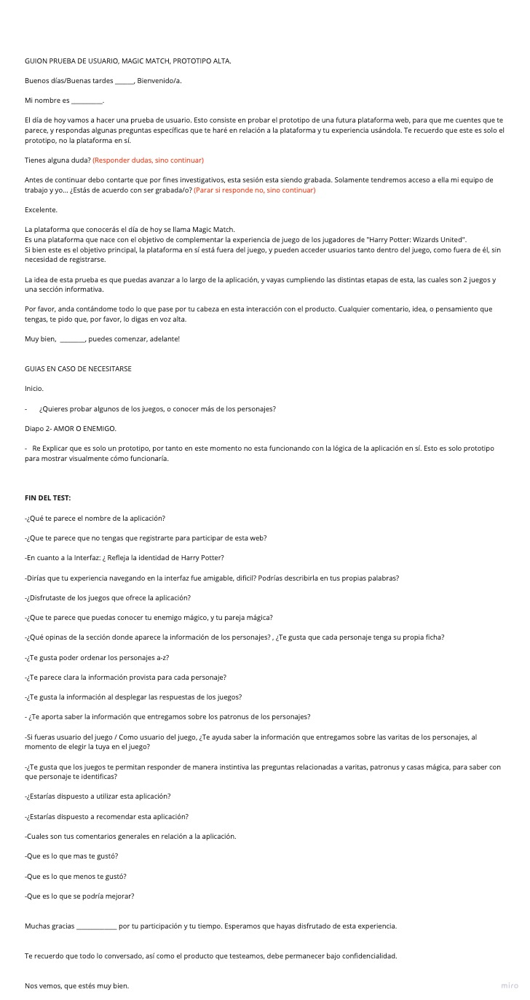
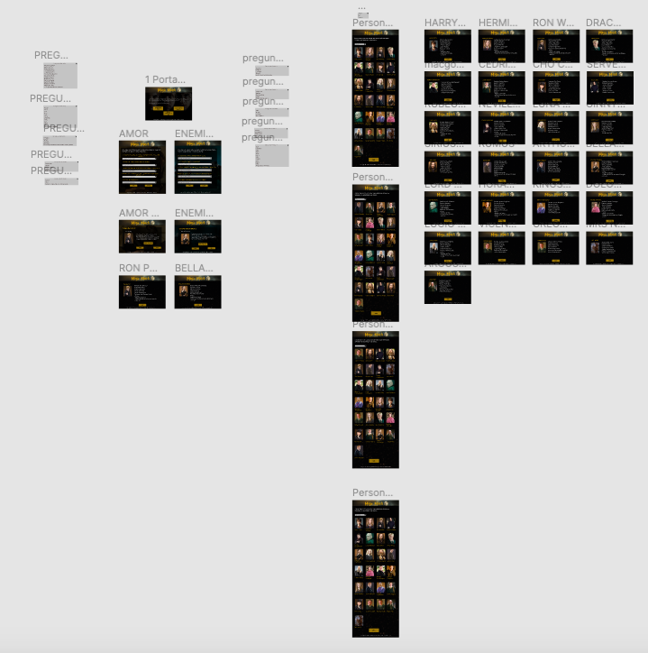

### INDICE

* [1. INTRODUCCIÓN A MAGIC MATCH](#introduccion)
* [2. MAGIC MATCH: TODO LO QUE NECESITAS SABER](#informacion)	
* [3. PLANIFICACIÓN](#construccion)	
* [4. DISEÑO UX](#diseno)	
* [5. CONCLUSIONES Y REFLEXIONES](#conclusiones)	
* [6. AGRADECIMIENTOS](#agradecimientos)	

***

<a id="introduccion"> :zap: 1. INTRODUCCIÓN A MAGIC MATCH :zap: </a>

Magic Match es una plataforma web basada en el imaginario de Harry Potter, que ofrece a sus usuarios la oportunidad de jugar dos tests, donde podrán encontrar su alma gemela mágica y su enemigo mágico, dentro de los personajes de esta misma Saga.

Adicionalmente, el usuario tiene acceso a la información técnica de cada uno de los personajes disponibles. 

***

<a id="informacion"> :sparkles: 2. MAGIC MATCH: TODO LO QUE NECESITAS SABER :sparkles: </a>

***Magic Match*** nace como respuesta ante la necesidad de nuestro cliente, por mejorar la experiencia de usuario de los jugadores de la plataforma: "Harry Potter: Wizards Unite". 

Luego de sus propios estudios en usuarios, se dieron cuenta que había ciertos elementos que podrían ser útiles de implementar, ya que aportarían a mejorar la experiencia  de aquellos usuarios. 

Estos elementos son:

:black_circle: Poder filtrar personajes por sus características, particularmente: 

-Patronus 

-Varita Mágica 

-Casa Mágica

-Profesión

:black_circle: Poder acceder a la información de los personajes disponibles en la base de datos. 

Bajo este concepto se concibe ***Magic Match***, cuyo objetivo principal es complementar la experiencia de usuario de los jugadores de "Harry Potter: Wizards Unite", a través de una plataforma web, que les permita participar de dos experiencias de estilo test. Como recompensa obtendrán sus Match Mágicos dentro de la gama de personajes disponibles, tanto en categoría Pareja, como Enemigo. 

El usuario además puede acceder a una sección de Personajes, donde encontrará las fichas técnicas de cada uno de los personajes que forman parte de la base de datos dispuesta por nuestro cliente. 

La plataforma ***Magic Match*** también permite el acceso a usuarios que no son participantes de "Harry Potter: Wizards Unite", pero que si se sienten atraídos por las experiencias relacionadas al mundo de Harry Potter. 

**¿Cómo funciona?**

El usuario entra a la Plataforma de ***Magic Match*** y escoge entre Descubrir su Pareja Mágica, su Enemigo Mágico o Conocer más sobre los personajes disponibles. 
No es necesario registrarse, ni estar vinculado a ninguna otra plataforma para acceder. 

Una vez que el usuario accede a cualquiera de los dos juegos disponibles, se le presenta un set de 5 preguntas, donde debe escoger su respuesta. 
Este set de preguntas está creado a partir de los elementos que desea implementar nuestro cliente, por tanto hay preguntas relacionadas con las varitas mágicas, los Patronus y las casas mágicas de los personajes. 

El mecanismo por el cuál se obtiene el match mágico del usuario es a través del filtrado, por tanto, el usuario efectivamente cumple con el objetivo técnico de filtrar, y lo hace a través de las respuestas que va entregando en cada pregunta, pero este es un filtrado intuitivo que entrega un resultado en función del instinto del usuario, y no un filtrado racional que solo arroja un orden predeterminado. 

Por otra parte, cuando el usuario ingresa a la categoría para conocer más sobre los personajes, puede ver las fotos de cada uno de ellos en la pagina web, las cuales puede ordenar bajo distintos criterios, como alfabéticamente y por relevancia. 
Al hacer click en cualquiera de las fotos disponibles, el usuario accede a una ficha técnica con información del personaje seleccionado. 

***	

<a id="construccion"> :dizzy: 3. CONSTRUCCIÓN DEL PROYECTO :dizzy: </a>

Te invitamos a acceder nuestra plataforma de trabajo, donde podrás ver gráficamente todo el proceso de este Proyecto. 

[Ingresa aquí a nuestro Board en Miro](https://miro.com/app/board/o9J_ktGidAY=/)

### El comienzo 

Todo empieza cuando nuestro cliente plantea la necesidad de crear una plataforma que potenciara la experiencia de los usuarios de "Harry Potter: Wizards Unite", implementando soluciones a las necesidades descubiertas luego de investigaciones UX. 

Si bien lo esencial era implementar el mecanismo de filtrado, y desplegar las fichas de los diferentes personajes, no queríamos simplemente ser un apéndice enciclopédico para el juego, sino estimular al usuario a partir de una experiencia interactiva, intiutiva y con recompensas, con una interfaz amigable, sencilla y que represente la ideantidad de Harry Potter. 

Ideamos un primer Diagrama de Flujo de la aplicación, donde se refleja la primera aproximación a nuestra propuesta.

Con este primer paso teníamos un punto de partida, pero luego de ir trabajando en nuestra propuesta y recibiendo feedback, se concibió la idea de lo que hoy es ***Magic Match***: Una aplicación que no solo muestra al usuario su afín de pareja en el mundo de Harry Potter, sino también su enemigo. 
Con esto, ***Magic Match*** se convirtió en una idea ganadora para nuestro equipo. 

Luego de tener claro hacia donde nos dirigíamos, comenzamos nuestra planificación, para llevar a cabo el proyecto. 

### Organización del Proyecto

Nuestra forma de trabajo se basa en la metodología SCRUM de Metodologías Ágiles. 

Comenzamos nuestro proceso de planificación desglosando cada diferente tarea y objetivo en un tablero de trabajo. 

[Visita acá nuestro Desglose del Proyecto](https://trello.com/b/uGPxOAaF/harry-potter)

Con una aproximación más clara de nuestras misiones y objetivos, creamos una calendarización de nuestro proyecto, en la misma plataforma.

[Visita acá nuestro Calendario](https://trello.com/b/x3gtxXLE/calendario-planificaci%C3%B3n-data-lovers)

El proceso de planificación se dividió en 4 Sprint: 

:black_circle: Planificación e Investigación

:black_circle: Desarrollo

:black_circle: Codeo

:black_circle: Testeo y Afinamiento. 

La idea general de nuestra planificación fue setear tareas diarias, para ir resolviendo en equipo.

Cada día realizamos un Daily Meeting, que nos sirvió para ir poniéndonos al tanto como equipo, e ir avanzando en conjunto hacia los objetivos diarios. 

Al final de cada Sprint tuvimos una Retrospectiva de la semana, donde preparamos el tablero de Actividades para el siguiente Sprint. 

Con la planificación clara, procedimos a trabajar en nuestro proyecto. 

### Desarrollo

**SPRINT** :one:

Comenzamos el Sprint tomando dos lineas principales de trabajo. La primera fue Investigación, donde se estudió constantemente las distintas temáticas a aplicarse en nuestro proyecto, desde las diferentes perspectivas desde donde se construye. 

En paralelo, tuvimos el proceso de búsqueda para definir y redefinir la aplicación, y setearla como lo que actualmente proponemos como Magic Match. 

Creamos un nuevo diagrama de flujo, el cuál marca el flujo real con que se desarrolla la aplicación actualmente. 

Definimos el Backlog del Proyecto y también del Sprint. 

Con esto comenzamos a llevar a cabo los distintos procesos de Diseño Ux, y también trabajamos en escribir historias de Usuarios y practicar Java Script. 

Finalmente, integramos todos los elementos y documentos necesarios para nuestro trabajo, en la plataforma Miro. Es el link presentado al principio de esta categoría, pero puedes encontrarlo nuevamente [aquí.](https://miro.com/app/board/o9J_ktGidAY=/)

Terminamos la semana con una retrospectiva, y reformulamos el Backlog del Sprint 2,  Tablero de Actividades de este Sprint, incluyendo las historias de Usuarios. 

**Sprint** :two:

Este segundo Sprint fue enfocado en Iteraciones de Pruebas de usuario, y trabajar en el material que se utilizaría en la plataforma. 

Se re escribieron los textos finales a utilizar, y se hizo una nueva búsqueda de elementos que aportasen a la construcción de la identidad visual de la aplicación, ya que era un punto fundamental a mejorar. 

También continuamos practicando Java Script, según las necesidades que teníamos para el código del proyecto y se trabajó en el Readme que actualmente están visualizando. 

Tuvimos la restrospectiva final de la semana, y replanteamos nuestro Backlog del Sprint 3, en el tablero de actividades para este Sprint. 

**Sprint** :three:

El punto de partida de este Sprint, fue comenzar a escribir el código de nuestra aplicación, en función de la maqueta que fue aprobada. 

Reformulamos nuestra planificación, ya que el deadline de entrega, fue posterior a lo que originalmente teníamos contemplado, por tanto pudimos re organizarnos y distribuir de mejor manera las actividades que nos quedaban por llevar a cabo. 

Por completar esta parte al final de Sprint 3. 

**Sprint** :four:

Por completar en Sprint 4. 

***
 
<a id="diseno">   :boom:  4. DISEÑO UX  :boom:  </a>

El eje central de nuestro trabajo fue el diseño UX. 

Nuestro proceso de construcción del proyecto tiene como objetivo exponenciar la experiencia de los usuarios de "Harry Potter: Wizards Unite", bajo la implementación de mecanismos solicitados como requisitos técnicos fundamentales, en una Interfaz amigable y sencilla de navegar, que refleje la identidad visual de Harry Potter. 

A continuación detallamos paso a paso, toda la construcción del diseño UX de la plataforma Magic Match. 

### Usuarios Plataforma 

Podemos identificar 2 perfiles de usuario predominantes en nuestra aplicación.

:black_medium_small_square:	Usuario que juega "Harry Potter: Wizards Unite". 

:black_medium_small_square:	Usuario que no juega "Harry Potter: Wizards Unite", pero que gusta de involucrarse con el mundo de Harry Potter. 

**Perfil Usuario A:** 

Hombres y mujeres. 

Mayores de 10 años.

Usuarios de "Harry Potter: Wizards Unite".

Con acceso a plataforma web. 

Usuario A, es un hombre o mujer, mayor de 10 años, con acceso a plataforma web. 
Este usuario juega activamente el juego "Harry Potter: Wizards Unite". 
Este usuario disfruta de utilizar plataformas que lo involucren en el mundo de Harry Potter, especialmente si esa experiencia va a ser un aporte para su experiencia en otras instancias, por ejemplo, al momento de elegir algunas características de su perfil en la plataforma donde juega. 

Necesidades Usuario A:

* Acceso a plataforma relacionada con el mundo Harry Potter
* Plataforma que potencie su experiencia en relación a "Harry Potter: Wizards Unite". 
* Poder obtener información sobre los personajes del juego 
* Conocer información sobre las varitas de los personajes 
* Poder hacer filtrado de los personajes con distintas categorías, entre ellas: Varita Mágica,    Patronus y Casa Mágica. 
* Acceder a una interfaz amigable que representa la identidad visual de Harry Potter. 

***Perfil Usuario B***

Hombres y mujeres. 

Sin rango etario

Gustan del mundo Harry Potter. 

Con acceso a una plataforma web

Usuario B, es un hombre o mujer, sin rango etario, con acceso a plataforma web. 
Este usuario gusta del mundo Harry Potter, por tanto disfruta y tiene interés en las instancias que lo relacionen a este. 

Necesidades Usuario B:

* Acceso a plataforma relacionada con el mundo Harry Potter y que esta sea interesante. 
* Navegar en una aplicación divertida, que lo identifique con el mundo de Harry Potter. 
* Acceder a una interfaz amigable que se represente la identidad visual de Harry Potter. 

Cliquea en la imagen, para agrandar nuestro diagrama de "Cliente, Usuarios y Necesidades". 

### Interfaz y Prototipado :memo: :computer:

Para la construcción de la interfaz de la aplicación, trabajamos en continuas iteraciones de prototipos en baja y alta, con el fin de tener un feedback nutrido gracias a las pruebas de usarios. 

Comenzamos realizando sketchs en lápiz y papel, para luego digitalizarlos y construir un primer prototipo en baja. 

La idea era testear si el concepto de nuestra aplicación era bien acogido, y si funcionaba el flujo de la aplicación. 

Luego de estos primeros testeos, pudimos validar que nuestra aplicación tenía buena acogida, pero que era fundamental darle la visualidad que queríamos implementar. 

Realizamos una iteración en baja, con un primer acercamiento visual. El objetivo era obtener feedback sobre la estética de la aplicación, y revalidar el concepto de esta misma. 
Gracias al feedback recibido, decidimos trasladar el proceso a Figma, para realizar nuestro primer Prototipo en Alta. 

Con este prototipo en Alta listo, hicimos una ronda de feedback. Gracias a este, aplicamos algunos cambios menores y comenzamos a probar nuestro prototipo a mayor escala, a través de entrevistas grabadas y pautadas con guión. 

Links para revisar entrevistas a Usuarios:

[Video Entrevista 1](https://drive.google.com/file/d/11MZlOLxsLa-VkMGXeKXGdflFkwX8qnmx/view)

[Video Entrevista 2](https://drive.google.com/file/d/1cU3r69QLSarrMsbWBaNo1wlmIoBlWi-x/view)

[Video Entrevista 3](https://drive.google.com/file/d/1HsBQL7ww3gaurUcJOdQYaGdWNRkHDOk9/view)

[Video Entrevista 4](https://drive.google.com/file/d/1Js4NyYOjZX99aLpa1UTmV7DEBiIzf141/view)

[Video Entrevista 5](https://drive.google.com/file/d/1PB58zlhh5eSOttcKoR1hffN3Kukv-H5d/view)

Como resultado de estas entrevistas, pudimos inferir lo siguiente:

:black_circle: Existen los usuarios perfilados. :+1:

:black_circle: Usuarios aprueban la aplicación en general. :+1:

:black_circle: Usuarios disfrutan de los juegos de la aplicación. :+1:

:black_circle: Usuarios prefieren las preguntas técnicas que los relacionan a los personajes. :+1:

:black_circle: Algunos usuarios si ocuparían la Data al momento de tomar deciciones en otras plataformas ligadas al mundo Harry Potter, y otros no. :+1::-1:

:black_circle: Usuarios encuentran incongruencias en Data. :-1:

:black_circle: No toda la data entregada es relevante para el usuario.  :-1:

:black_circle: Usuarios necesitan una mejora en la visualidad, que sea más cercana a Harry Potter. :-1:

:black_circle: Usuarios no disfrutan de preguntas relacionadas a rasgos físicos de los personajes. :-1:

Con estos resultados, realizamos una última iteración de nuestro Prototipo en Alta, el cuál se convirtió en nuestra maqueta final desde la cuál comenzamos a codear el proyecto. 

[Revisa Maqueta final del Proyecto Aquí](https://www.figma.com/proto/OeNXAYKwT5D1xtDiRVn63F/HARRY-POTTER-3-DATA-LOVERS?node-id=8%3A1&viewport=355%2C236%2C0.03604096546769142&scaling=min-zoom)

Una vez lista la maqueta, esta fue implementada en Maze, para llevar a cabo nuevas pruebas de usuario.

[Revisa Resultados de Pruebas en Maze Aquí](https://maze.design/projects/10762980/mazes/10762981/results)

[Revisa Informe de Pruebas en Maze Aquí](https://maze.design/r/7c89ck7xk9pa69nb#mission-1)

Estas pruebas de usuaron se enfocaron en confirmar la mejora en las distintas áreas que obtuvieron resultados mas bajos en las pruebas de usuario anteriores, y que tuvimos que re construir. 
Las áreas a trabajar fueron:

-Mejorar visualidad y acercarla más a Mundo Harry Potter. 

-Mejorar calidad de preguntas. 

-Entregar data de personajes que no tenga incongruencias con el imaginario de Harry Potter. 

-Confirmar que el usuario gusta de la aplicación. 

Luego de realizar las pruebas en Maze a 12 usuarios, podemos concluir lo siquiente:

:black_circle: Existieron problemas técnicos en la implementación de la maqueta en Maze, lo cuál incide en los porcentajes obtenidos en el Reporte que nos entrega la plataforma de testeo. Esto afectó el porcentaje de usabilidad de la aplicación, así como fue parte de los comentarios de los usuarios. 

:black_circle: A pesar de los problemas técnicos, el usuario fue capaz de entender la aplicación y de contestar las preguntas directas que se solicitaban, para así obtener una respuesta en cuanto a las inquietudes que buscábamos resolver resolver a través de estos testeos. 

:black_circle: Usuarios disfrutan de la aplicación. 

:black_circle: Usarios encuentran las preguntas pertinentes, y valoran las preguntas ténicas. 

:black_circle: Usuarios confirman que la identidad visual de Harry Potter es alcanzada. 

:black_circle: Usuarios no tienen reparos en cuanto a la data desplegada. 

Con estos resultados, decidimos que era el momento de comenzar a trabajar en la aplicación real, basándonos en la maqueta testeada, ya que cumple con las expectativas que deseamos, para así cumplir con los objetivos expuestos. 

Por completar al principio de Sprint 4 

PRUEBAS DE USUARIO PRODUCTO FINAL. TBC

PRODUCTO FINAL + LINK EN GIT HUB PAGES 

***	

<a id="conclusiones"> :first_quarter_moon_with_face:  5. CONCLUSIONES Y REFLEXIONES :first_quarter_moon_with_face:</a>

:o: El usuario siempre está en búsqueda de una mejor experiencia de usuario. 

Por completar al principio de Sprint 4:

Resolvemos necesidades de Cliente? 

Resolvemos necesidades de usuario? 

Qué se nos hizo difícil?

Qué se nos hizo fácil?

Cuplimos Objetivos? Reflexión al respecto. 

Como podemos mejorar? 

Reflexión conclusiva. 

***	

<a id="agradecimientos"> :sun_with_face: 6. AGRADECIMIENTOS  :sun_with_face: </a>

Por completar al principio de Sprint 4. 

Copyright by Yosliana Aguilar y Paula Trujillo, 2020 | Laboratoria 013

